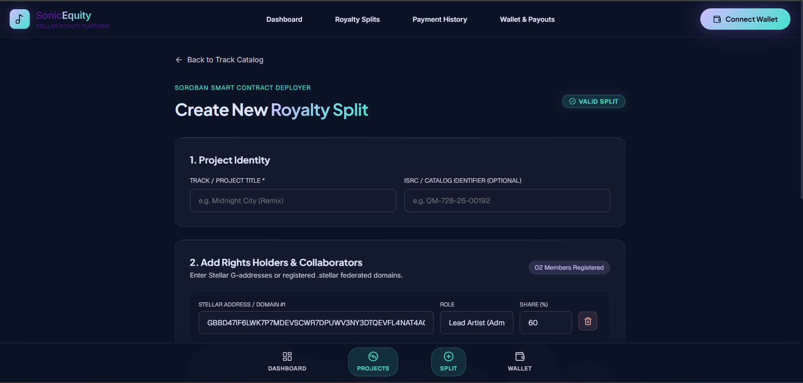
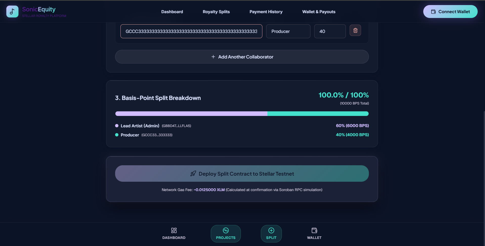
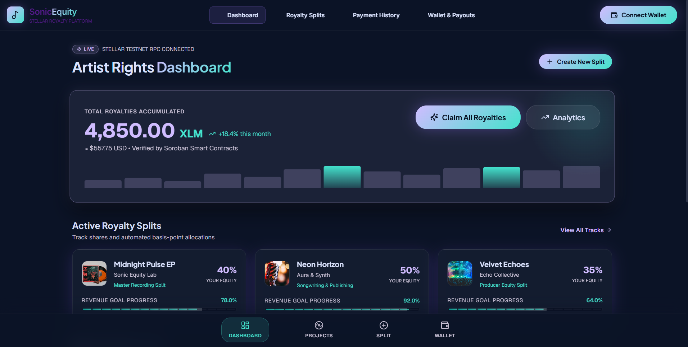
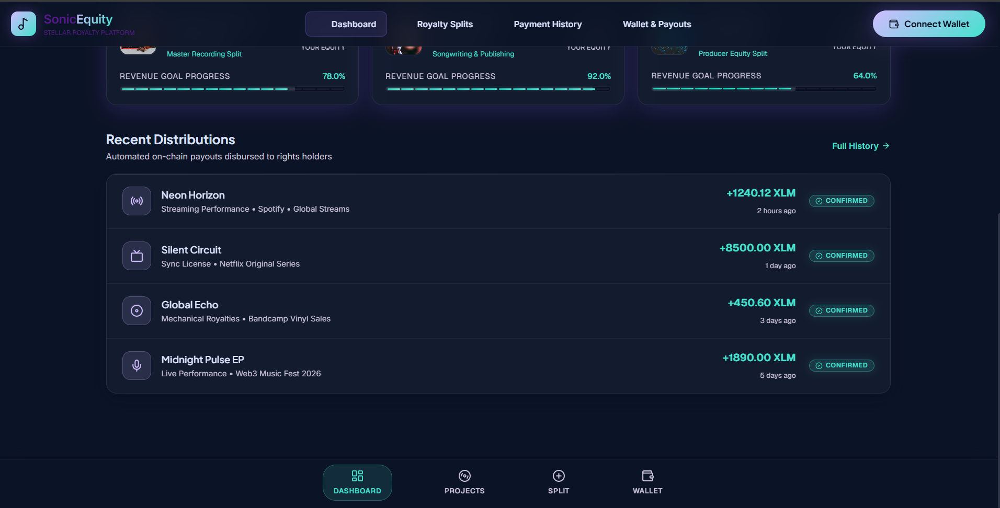
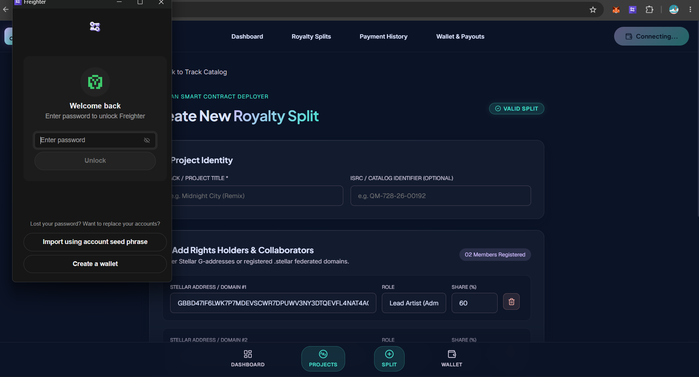
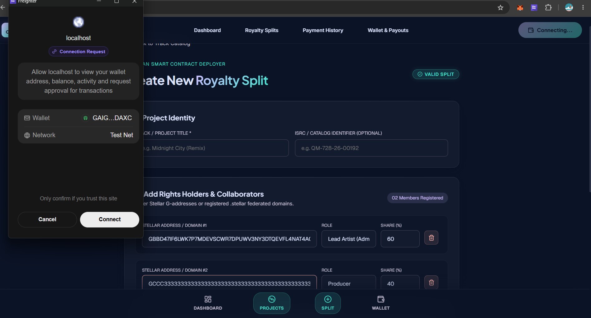
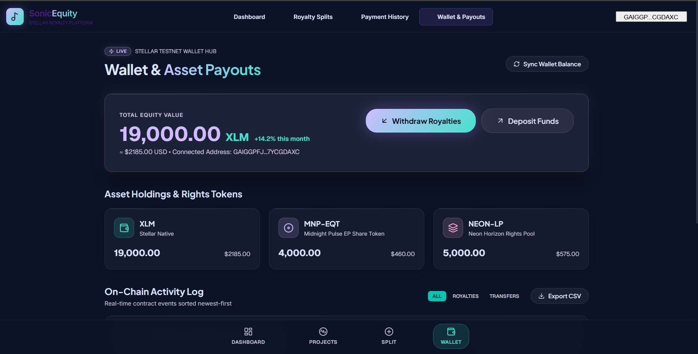

<div align="center">

# 🎵 SonicEquity — On-Chain Royalty Splitting Platform

### *High-Fidelity Automated Royalty Distributions for Musicians on Stellar & Soroban*

[](https://www.rust-lang.org/)
[](https://soroban.stellar.org/)
[](https://stellar.expert/explorer/testnet)
[](https://nextjs.org/)
[](https://www.typescriptlang.org/)
[](LICENSE)

</div>

---

## 🌐 Live Deployed Application

> [!IMPORTANT]
> ### ⚡ **[SonicEquity Live Web Application](https://agent-6a65b9374fb70db14--dancing-basbousa-1fb1a8.netlify.app/)**
> 
> 🔗 **Live URL**: **[https://agent-6a65b9374fb70db14--dancing-basbousa-1fb1a8.netlify.app/](https://agent-6a65b9374fb70db14--dancing-basbousa-1fb1a8.netlify.app/)**
>
> 💻 **Local Development Entry Point**: **[http://localhost:3000](http://localhost:3000)**

---

## 🌟 Overview

**SonicEquity** is a production-grade web application and Soroban smart contract suite designed for musicians, rights holders, and music producers. It provides real-time, automated royalty splits directly on the Stellar Blockchain Network.

By replacing opaque middleman distributors with immutable **Soroban smart contracts**, every incoming payout is atomically calculated, divided according to agreed-upon basis-point shares ($10,000 = 100\%$), and disbursed directly to collaborators' wallets without delays or dust-loss rounding errors.

## 📷 Application Showcase & Interface Designs

<div align="center">

### 1. Artist Rights Dashboard
*Overview of Total Rights Revenue, Active Splits level progress bars, and recent payment distributions.*
<br/>


<br/><br/>

### 2. Create New Royalty Split
*Dynamic collaborator registration with Basis-Point validation ($10,000$ BPS) and domain resolution.*
<br/>
<div display="flex" gap="10">
  
  
</div>

<br/><br/>

### 3. Project Details & Interactive Audio Scrubber
*Track metadata, audio player scrubber, split breakdown, and Recharts payout history (1M/6M/1Y).*
<br/>
<div display="flex" gap="10">
  
  
</div>

<br/><br/>

### 4. Wallet Payouts & Filterable Activity Log
*Live XLM/USD equity value, asset holdings list, and filterable on-chain contract events.*
<br/>


<br/><br/>

### 5. Claim Royalties Modal & Soroban RPC Readiness
*Centered glassmorphic modal with scan-line beam, fee breakdown, and on-chain withdrawal confirmation.*
<br/>


</div>

---

## ✨ Full Product Surfaces & Features

| Surface / Screen | Route | Description & Soroban Contract Integration |
| :--- | :--- | :--- |
| **3.1 Dashboard** | [`/`](http://localhost:3000/) | **Total Rights Revenue** readout in XLM & USD, **Claim All** trigger, **Active Splits** horizontal scroll cards with LevelMeter progress bars, and **Recent Distributions** feed. |
| **3.2 Create New Split** | [`/tracks/new`](http://localhost:3000/tracks/new) | Dynamic collaborator rows with `.stellar` domain resolution, live Basis-Point ($10,000$ BPS / $100\%$) validation, gas fee estimation, and `RoyaltySplitContract` deployment. |
| **3.3 Project Details** | [`/tracks/[id]`](http://localhost:3000/tracks/Midnight-Pulse-EP) | Hero media panel, interactive audio scrubber, `ON-CHAIN VERIFIED` chip, Recharts payout history (1M/6M/1Y), and Soroban contract address card with explorer links. |
| **3.4 Wallet & Payouts** | [`/wallet`](http://localhost:3000/wallet) | **Total Equity Value** in XLM/USD, asset holdings breakdown, filterable on-chain activity log (`AUTOMATED`, `ON-CHAIN`, `CONFIRMED`), and CSV export action. |
| **3.5 Claim Royalties Modal** | Global Modal | Glassmorphic modal with scan-line beam, wallet ping icon, net receivable readout, fee breakdown, live Soroban RPC ping status, and withdrawal execution. |
| **Track Catalog** | [`/tracks`](http://localhost:3000/tracks) | Complete governance catalog of registered split contracts with filter chips (Active/Drafts) and edit shortcuts. |

---

## 🎨 Design System ("High-Fidelity Fintech")

Implemented strictly according to Material-3 token specifications:

- **Obsidian Night Palette**: `#0b1326` base (`surface`, `surface-dim`, `surface-bright`, `surface-container-*`).
- **Primary Accent (Electric Violet)**: `#d0bcff` / `#a078ff` for primary CTAs and brand identity.
- **Secondary Accent (Cyan Pulse)**: `#44e2cd` / `#03c6b2` for data visualizations, level meters, and verification badges.
- **Tertiary Accent (Magenta Flare)**: `#ffafd3` for high-performing asset callouts.
- **Typography**: **Plus Jakarta Sans** (Display/Headlines), **Inter** (Body), and **Geist Monospace** (On-chain data, BPS, hashes, public keys).
- **Glassmorphism**: `.glass-panel` (Level 2 depth with 20px blur and top-left light border highlight) & `.glass-modal` (Level 3 depth with 40px blur and luminous glow).
- **Audio-Mixer Level Meter**: `.level-meter-fill` with linear shimmer sweep keyframe animations.

---

## 🔗 Contract & API Mapping

| UI Action | Contract / API Call | File Reference |
| :--- | :--- | :--- |
| **Connect Wallet** | `requestAccess()` & `getAddress()` via Freighter API | [`lib/freighter.ts`](file:///c:/Users/Shritesh/OneDrive/Desktop/P-4/frontend/lib/freighter.ts) |
| **Fetch Balance** | Horizon Server `loadAccount(publicKey)` | [`lib/stellar.ts`](file:///c:/Users/Shritesh/OneDrive/Desktop/P-4/frontend/lib/stellar.ts) |
| **Deploy Split** | `callContract(contractId, 'initialize', args, ...)` | [`lib/contracts.ts`](file:///c:/Users/Shritesh/OneDrive/Desktop/P-4/frontend/lib/contracts.ts) |
| **Claim Royalties** | `callContract(splitContract, 'distribute', args, ...)` | [`components/ui/ClaimRoyaltiesModal.tsx`](file:///c:/Users/Shritesh/OneDrive/Desktop/P-4/frontend/components/ui/ClaimRoyaltiesModal.tsx) |
| **Event Stream** | Axum Indexer SSE `GET /tracks/:id/events` | [`backend/api`](file:///c:/Users/Shritesh/OneDrive/Desktop/P-4/backend/api) |

---

## 🏗️ System Architecture

```
                                  ┌─────────────────────────────┐
                                  │   Freighter Wallet (Browser) │
                                  └──────────────┬──────────────┘
                                                 │ Sign XDR
                                                 ▼
┌─────────────────────────┐           ┌─────────────────────────┐
│   Next.js 14 Frontend   │──────────►│  Soroban RPC (Testnet)  │
│  • Dashboard            │           │  soroban-testnet.       │
│  • Royalty Splits       │           │  stellar.org            │
│  • Payment History      │           └──────────┬──────────────┘
│  • Wallet Payouts       │                      │
└────────────┬────────────┘                      │ getEvents (polling)
             │ SSE Stream                        ▼
             ▼                        ┌─────────────────────────┐
┌─────────────────────────┐           │   Rust Event Indexer    │
│   Axum API Server       │◄──────────│  (backend/indexer)      │
│   (backend/api)         │  writes   └──────────┬──────────────┘
└────────────┬────────────┘                      │
             │                                   ▼
             │                        ┌─────────────────────────┐
             └───────────────────────►│  SQLite Database        │
                                      │  (royalty.db)           │
                                      └─────────────────────────┘
```

---

## 📦 Project Structure

```
stellar-royalty-platform/
├── Cargo.toml                       ← Rust workspace root (5 crates)
├── contracts/
│   ├── royalty-split/               ← Core split contract (Rust + Soroban SDK)
│   └── track-registry/              ← Track registry + cross-contract calls
├── backend/
│   ├── api/                         ← Axum 0.8 REST + SSE server (Rust)
│   └── indexer/                     ← Soroban RPC event poller → SQLite (Rust)
├── cli/                             ← Rust CLI deployment tool (clap)
├── frontend/                        ← Next.js 14 + TypeScript + Freighter API
│   ├── app/                         ← 5 Product surfaces & routes
│   ├── components/ui/               ← GlassCard, LevelMeter, StatusChip, Modals
│   └── lib/                         ← Stellar SDK & Soroban contract callers
├── stitch_transparent_artist_royalties/ ← Sonic Equity design assets & tokens
└── docs/                            ← Architecture, API docs, Demo script
```

---

## 🚀 Getting Started

### Prerequisites

- **Node.js** 18+ & `npm`
- **Freighter Wallet** browser extension (configured for **Testnet**)
- **Rust** 1.75+ (optional, if building Soroban contracts from source)

### 1. Start Web Application

```bash
# Navigate to the frontend directory
cd frontend

# Install dependencies (if not already installed)
npm install

# Start Next.js Development Server
npm run dev
```

Open **[http://localhost:3000](http://localhost:3000)** in your browser.

---

## 📜 Smart Contract Reference

### `RoyaltySplitContract` (`contracts/royalty-split`)

| Function | Access | Description |
| :--- | :--- | :--- |
| `initialize(track_id, admin, splits)` | Admin | Sets track ID and initial basis-point collaborator shares. |
| `distribute(payer, token, amount)` | Any | Pulls `amount` tokens from `payer` and splits to collaborators. |
| `approve_split_update(approver, hash)`| Collaborator | Emits approval consent for a proposed split hash. |
| `update_splits(admin, new_splits, hash)`| Admin | Applies new split shares once 100% consent is recorded. |
| `get_splits()` | Public | Returns current list of basis-point splits. |
| `get_track_id()` | Public | Returns string track identifier. |

### `TrackRegistryContract` (`contracts/track-registry`)

| Function | Access | Description |
| :--- | :--- | :--- |
| `initialize(admin)` | Admin | Initializes global track registry. |
| `register_track(admin, track_id, split_address)` | Admin | Verifies `split_address` via cross-contract call and registers track. |
| `pay_track(payer, track_id, token, amount)` | Any | Cross-calls `distribute` on the track's split contract. |
| `get_track(track_id)` | Public | Fetches track info and linked split contract address. |

---

## 🛠️ Build & Verification Commands

```bash
# Run Next.js production build and type-checking
cd frontend
npm run build

# Run Frontend Jest unit test suite
npm test

# Run Rust contract & workspace tests
cargo test --workspace
```

---

## 📄 License

Distributed under the **MIT License**. See `LICENSE` for details.


